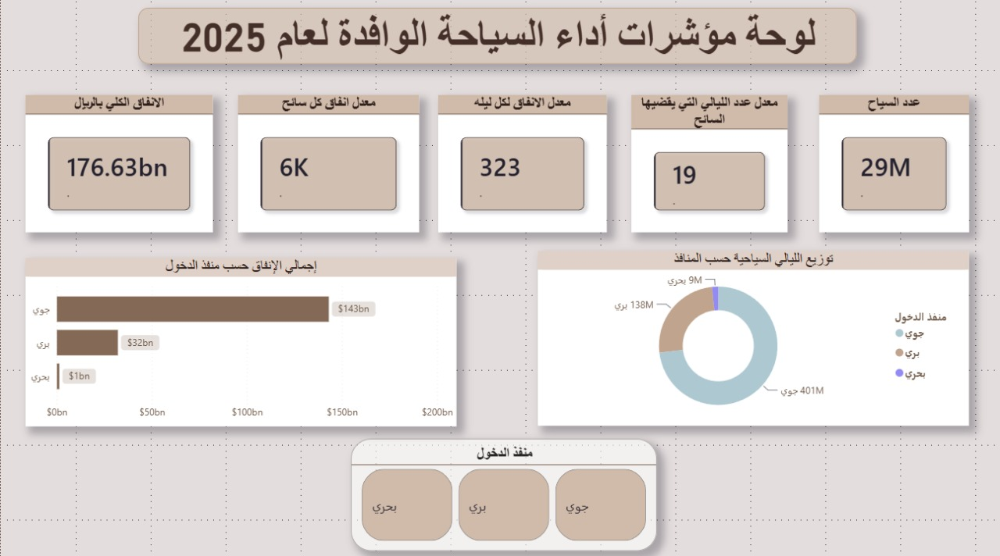

# 📊 لوحة مؤشرات أداء السياحة الوافدة في المملكة العربية السعودية لعام 2025

## 📝 وصف المشروع (Project Overview)
مشروع تحليل بيانات تفاعلي يهدف إلى دراسة وتتبع مؤشرات أداء السياحة الوافدة إلى المملكة العربية السعودية لعام 2025. تم بناء هذا المشروع باستخدام أداة **Power BI** لتحويل البيانات الخام الصادرة عن وزارة السياحة إلى رؤى استراتيجية (Business Insights) تدعم صناع القرار، وتكشف عن سلوك ومعدلات إنفاق السياح، والخصائص التشغيلية لكل منفذ من منافذ الدخول (جوي، بري، بحري).

---

## 🖼️ لوحة المؤشرات التفاعلية (Dashboard Preview)

---

## 🧮 المؤشرات الرئيسية في اللوحة (Key Performance Indicators)
تتضمن اللوحة 5 مؤشرات أداء رئيسية للوقوف على الوضع السياحي العام:
* **الإنفاق الكلي بالريال:** 176.63 مليار ريال سعودي.
* **عدد السياح الإجمالي:** 29 مليون سائح.
* **معدل عدد الليالي التي يقضيها السائح:** 19 ليلة.
* **معدل الإنفاق لكل ليلة:** 323 ريال.
* **معدل إنفاق كل سائح:** 6,000 ريال.

---

## 🔍 التقرير التحليلي التنفيذي لعام 2025 (Business Insights)

### 1️⃣ الكفاءة الاستهلاكية العالية للمنفذ البحري (High-Value / Low-Volume)
* **الملاحظة الرقمية:** بالرغم من أن المنفذ البحري يمثل الحصة الأقل عدداً (**201 ألف سائح فقط**)، إلا أن مؤشراته الذكية تكشف سلوكاً استهلاكياً ضخماً.
* **التحليل الاستراتيجي:** يتميز سياح المنافذ البحرية بكثافة إنفاق عالية جداً مقارنة بفترة إقامتهم القصيرة. هذا يعني أن العائد الاستثماري (ROI) على البنية التحتية للموانئ وسفن الكروز يعتبر مرتفعاً جداً، ويوصى استراتيجياً بزيادة الطاقة الاستيعابية للموانئ لاستقطاب هذه الفئة عالية الدخل.

### 2️⃣ استدامة الإقامة في المنافذ البرية (High-Volume / Long-Stay)
* **الملاحظة الرقمية:** يسجل المنفذ البري حصة قوية جداً تبلغ **138 مليون ليلة سياحية** مقضاة داخل المملكة.
* **التحليل الاستراتيجي:** يتميز القادمون عبر المنافذ البرية بطول فترة الإقامة (معدل بقاء مرتفع). ورغم أن إنفاقهم اليومي يعتبر الأقل مقارنة بالمنافذ الأخرى، إلا أن مكوثهم لفترات طويلة يضمن استدامة استهلاك الخدمات المحلية، وتنشيط قطاع الضيافة المتوسطة والفنادق بشكل مستمر طوال العام.

### 3️⃣ القيادة الاستراتيجية للمنفذ الجوي (The Market Driver)
* **الملاحظة الرقمية:** يستحوذ المنفذ الجوي على حصة الأسد من كعكة السياحة؛ مستقطباً **401 مليون ليلة سياحية**، ومحققاً الحصة العظمى من إجمالي الإنفاق بقيمة **143 مليار ريال** من أصل 176.63 مليار ريال.
* **التحليل الاستراتيجي:** يظل الطيران والنقل الجوي هو الركيزة الأساسية لتدفق الأموال وحجم الأرقام الكلي للمملكة. كفاءة الصرف اليومي المتوازنة (**323 ريال لليلة**) مع الأعداد المليونية الكبيرة (**29 مليون سائح**) تجعل المطارات هي البوابة الحيوية الأولى والأساسية لضمان تحقيق مستهدفات رؤية المملكة 2030 في القطاع السياحي.

---

## 🛠️ الأدوات والمهارات المستخدمة (Tools & Tech Stack)
* **Power BI Desktop:** لتصميم وتنفيذ لوحة المؤشرات، وبناء العلاقات بين البيانات (Data Modeling).
* **Power Query:** لتنظيف البيانات، معالجة القيم المفقودة، وإعادة هيكلة البيانات (ETL Processes).
* **لغة DAX:** لإنشاء المقاييس الذكية (Calculated Measures) والمؤشرات الرئيسية.

---

## 📂 هيكل ملفات المستودع (Repository Structure)
* `Saudi_Tourism_2025.pbix`: ملف المشروع الأصلي على Power BI.
* `Cleaned_Tourism_Data.xlsx`: ملف البيانات النظيفة والمستخدمة في التحليل.
* `dashboard.png`: صورة الواجهة النهائية للوحة المؤشرات.
* `README.md`: التقرير التحليلي التنفيذي للمشروع.
